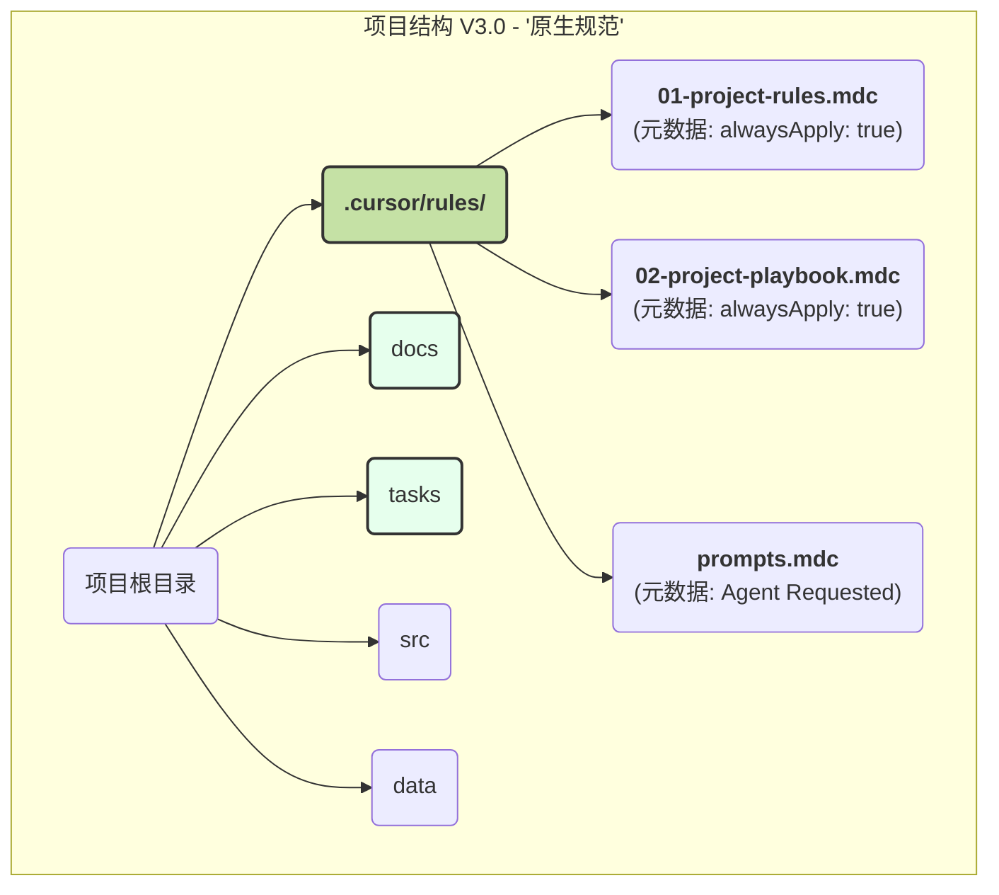

# 2025-06-10-项目结构进化史.md

## 背景
在我们合作的初期，为了实现项目的可迁移性和协作的规范性，我们共同设计了一套文件结构和协作方法论。本文档旨在记录该方法论从 V1.0 到 V3.0 的完整进化历程。

## V1.0: 初版设想
- **核心理念**: 通过创建不同文件夹来分离关注点。
- **结构**: `心路历程`, `进度记录`, `Curosr要求`, `src`, `data`。
- **评价**: 逻辑清晰，但命名不规范，且未与工具深度集成。

## V2.0: "工程化"规范
- **核心理念**: 引入标准的英文命名法，使结构更专业、可移植。
- **结构**: `docs`, `tasks`, `.cursor-settings`, `src`, `data`。
- **评价**: 结构和命名都达到了工程标准，但仍未充分利用 Cursor 的原生能力。

## V3.0: "原生"集成与最终形态
- **核心理念**: 全面拥抱 Cursor 编辑器的 `Project Rules` 功能，将我们的协作规则从"被动文档"升级为"主动指令"。
- **最终结构图**:

- **评价**: 这套方案将我们的方法论与工具的能力完美地融为了一体，实现了高度的自动化和智能化协作，达到了"无懈可击"的状态。

## V3.1: “元协作”与“价值积累” (2025-09-29)
- **核心理念**: 在 V3.0 的基础上，进一步明确了 AI 在此项目中的角色定位和我们的协作愿景。
- **角色定位**: AI 作为“元助理”(Meta-Assistant)，其唯一任务是与用户共同构建和迭代协作框架本身，不参与任何外部项目的具体开发。
- **协作愿愿**: 我们的目标是实现“价值积累”。在协作过程中，不仅要完成任务，更要将设计决策、战略思考、个人偏好等隐性知识，通过文档（`docs`）和规则（`.cursor/rules`）的形式沉淀下来，形成一套可进化的、个性化的“数字遗产”。
- **新增组件**:
  - `.cursor/rules/03-user-preferences.mdc`: 用于专门记录和管理用户的个人偏好，使 AI 的行为模式更符合用户习惯。

## V4.0 / v1.1.0: “模板工厂”化 (2025-09-29)
- **核心理念**: 将模板本身从一个静态的“脚手架”升级为一个动态的、拥有自我复制和管理能力的“模板工厂”。
- **结构变更**:
  - **引入 `_meta` 目录**: 创建 `_meta` 文件夹，用于存放所有与模板开发相关的“元知识”（如本文档、开发任务卡等），将“模板内容”与“开发历史”完全分离。
  - **净化模板根目录**: 将 `docs` 和 `tasks` 移动到 `_meta` 后，在根目录重新创建空的同名文件夹，作为新项目的纯净起点。
- **核心工具**:
  - `generate-project.ps1`: 创建了一个强大的 PowerShell 脚本，用于一键从此“母版”生成干净、标准的新项目，将手动流程自动化，是“价值积累”理念的直接产物。
- **管理升级**:
  - **引入版本控制**: 建立了 `_meta/docs/versioning-policy.md`，正式采用语义化版本对模板母版进行管理，标志着项目进入了更成熟的维护阶段。
- **评价**: 这次升级是项目从“一个模板”到“一套可维护、可复制的方法论系统”的关键一步，极大地提升了框架的专业性和可用性。

## V5.0 / v2.0.0: “AI 角色化软件开发工作流” (2025-10-19)
- **核心理念**: 基于用户的实战经验，将模板的定位从“通用协作框架”**升维**至“专业的、文档驱动的 AI 软件开发生命周期 (SDLC) 框架”。
- **工作流革命**:
  - **文档驱动**: 确立了以 `.md` 文档的演进作为软件开发核心驱动力的模式。
  - **AI 角色化**: 提倡为 SDLC 各环节（设计、质检、编码）建立专精的 AI 角色，并在独立 Chat 中运作，以保证高质量和上下文纯净。
- **结构变更**:
  - **淘汰 `prompts.mdc`**: 废弃了原有的、中心化的单体提示词文件。
  - **引入 `prompts-library`**: 创建了全新的、结构化的提示词库，分为 `guides` (方法论) 和 `roles` (生产就绪角色) 两部分，奠定了系统化提示词工程的基础。
- **管理升级**:
  - **提示词质量保障**: 在 `guides` 中建立了包含“元角色”（如 Prompt Critic）的质量保障流程，标志着我们从“使用提示词”进入“管理提示词”的阶段。
- **评价**: 这是模板**从 V1 到 V2 的一次质的飞跃**。它不再仅仅是一个通用的协作规范，而是内嵌了一套先进、具体、经过实战检验的软件开发方法论，使其价值和专业性得到了极大的提升。 