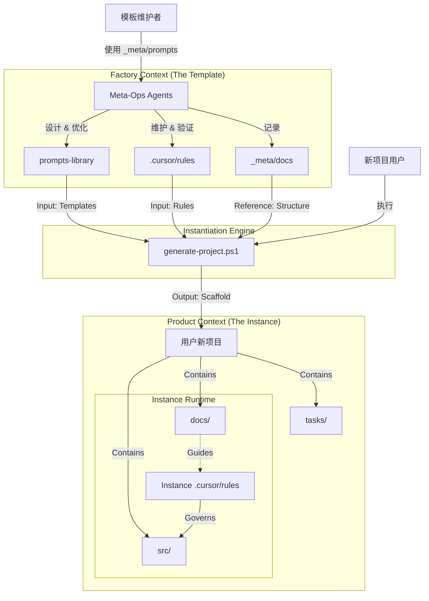

# 🗺️ 模板项目地图 (Factory Map) - V2.0 (Prometheus Edition)
> **注意**: 本地图仅描述“协作模板母版”自身的结构。新生成的项目会有其独立的业务地图。

## 1. 核心地形 (Topology)

本项目是一个**“提示词资产工厂”**，结构上严格区分 **工厂上下文 (Factory Context)** 与 **产品上下文 (Product Context)**。

### 🏭 Factory Context (生产端)

负责生产、维护和管理提示词资产的核心区域。

*   **📂 核心资产 (`prompts-library/`)**: 交付给用户的核心产品。
    *   `templates/capabilities/`: **原子能力 (Atomic Capabilities)** - 符合 Prometheus XML 标准的 Agent。
        *   **`development/architect/`**:
            *   `prometheus-prompt-engineer.md`: **Prometheus** - 提示词工程师 (Meta-Architect)。
            *   `project-mapper.md`: **Map Updater** - 目标项目地图维护者。
        *   **`development/frontend/`**:
            *   `streamlit-expert.md`: **Streamlit Expert** - 前端开发专家。
        *   **`development/maintenance/`**:
            *   `code-maintainer.md`: **The Detective** - 代码维护与重构。
        *   **`ops/`**:
            *   `python-distributor.md`: **Distributor** - Python 包发布专家。
        *   **`product/`**:
            *   `technical-pm.md`: **TPM** - 技术产品经理 (任务拆解)。
            *   `project-advocate.md`: **Project Advocate** - 需求与文档一致性守护者。
        *   **`testing/`**:
            *   `rubric-specialist.md`: **Rubric QA** - 基于评分标准的测试专家。
    *   `templates/patterns/`: **协作模式 (Team Patterns)** - 多个原子能力的编排。
        *   `virtual-streamlit-team.md`: 虚拟 Streamlit 研发团队 (TPM + DEV + QA)。
    *   `guides/`: **使用说明书**。
        *   `prompt-writing-guide.md`: 提示词编写指南。

*   **📂 维护工具 (`_meta/`)**: 维护本工厂的工具与记录 (不会复制到新项目)。
    *   `prompts/ops/`: **运维元角色团队 (Meta-Ops)**
        *   `project-incubator.md`: **Project Incubator** - 项目孵化器 (交互式创建向导)。
        *   `rule-checker.md`: **Prometheus Validator** - 强制检查 XML/CoT 结构。
        *   `map-updater.md`: **Cartographer Agent** - 维护工厂地图 vs 产品地图的隔离。
        *   `prompt-extractor.md`: **Pattern Distiller** - 从对话中蒸馏新模板。
        *   `version-bumper.md`: **Automation Agent** - 管理 SemVer 版本号。
    *   `docs/`: 架构决策记录 (ADR) 与演进文档。
        *   `模板项目地图.md`: **The Truth** - 本文件。
        *   `versioning-policy.md`: 版本管理策略。
        *   `2025-06-10-project-structure-evolution.md`: 项目结构演进记录。
        *   `2025-11-26-prompt-evolution-strategy.md`: 提示词演进策略。
        *   `2025-11-27-advanced-prompt-engineering-seminar.md`: 高级提示词工程研讨。
        *   `2025-11-27-architecture-evolution-roadmap.md`: 架构演进路线图。
        *   `2025-11-27-prompt-library-refactoring.md`: 提示词库重构记录。
        *   `2025-11-27-rule-system-test-cases.md`: 规则系统测试用例。
    *   `legacy_roles/`: 归档的旧版角色 (已废弃)。

*   **📂 运行时法则 (`.cursor/rules/`)**: 控制 AI 行为的指令集。
    *   `01-project-rules.mdc`: **Global Constitution** - 认知协议、文档标准与沟通法则。
    *   `02-project-playbook.mdc`: **Lifecycle State Machine** - 定义 Bootstrapping / Development / Maintenance 状态。
    *   `03-user-preferences.mdc`: **User Registry** - 用户偏好覆盖逻辑。
    *   `virtual-streamlit-team.mdc`: **Team Orchestrator** - 模式激活器。
    *   `template-maintenance-mode.mdc`: **Maintenance Switch** - 模板维护模式专用规则。
    *   `project-map-summary.mdc`: **Mini-Map** - 高层拓扑摘要。

### 📦 Product Context (交付端)

新项目实例化后的预期结构（在模板中仅作为占位符或示例存在）。

*   `docs/`: 项目文档 (实例化后存储具体项目的文档)。
*   `tasks/`: 任务追踪 (实例化后存储具体项目的任务)。
*   `src/`: 源代码 (实例化后生成)。
*   `README.md`: 项目入口。
*   `generate-project.ps1`: **启动器** - 执行实例化过程的脚本。

## 2. 关键数据流 (Data Flow)

## 3. 维护者指南 (Maintainer Guide)

1.  **新增角色 (Capability)**:
    *   在 `prompts-library/templates/capabilities/` 下对应分组创建 `.md` 文件。
    *   必须继承 `Prometheus` 标准 (XML 结构)。
    *   运行 `_meta/prompts/ops/rule-checker.md` 验证合规性。

2.  **新增模式 (Pattern)**:
    *   在 `prompts-library/templates/patterns/` 定义编排逻辑。
    *   在 `.cursor/rules/` 添加对应的 Orchestrator (`.mdc`)。

3.  **架构变更**:
    *   任何目录结构的变动，必须立即通过 `map-updater.md` 更新本文件及 `project-map-summary.mdc`。
    *   更新 `_meta/docs/versioning-policy.md` 版本号。
