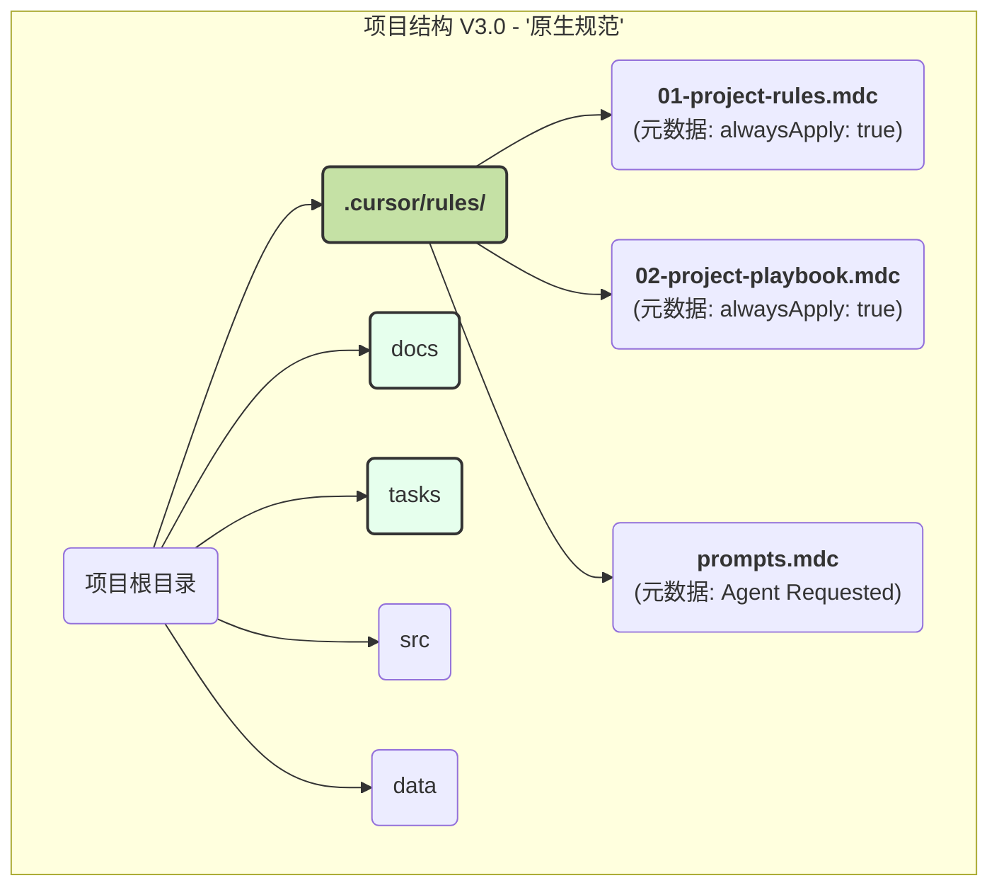

# 2025-06-10-项目结构进化史.md

## 背景
在我们合作的初期，为了实现项目的可迁移性和协作的规范性，我们共同设计了一套文件结构和协作方法论。本文档旨在记录该方法论从 V1.0 到 V3.0 的完整进化历程。

## V1.0: 初版设想
- **核心理念**: 通过创建不同文件夹来分离关注点。
- **结构**: `心路历程`, `进度记录`, `Curosr要求`, `src`, `data`。
- **评价**: 逻辑清晰，但命名不规范，且未与工具深度集成。

## V2.0: "工程化"规范
- **核心理念**: 引入标准的英文命名法，使结构更专业、可移植。
- **结构**: `docs`, `tasks`, `.cursor-settings`, `src`, `data`。
- **评价**: 结构和命名都达到了工程标准，但仍未充分利用 Cursor 的原生能力。

## V3.0: "原生"集成与最终形态
- **核心理念**: 全面拥抱 Cursor 编辑器的 `Project Rules` 功能，将我们的协作规则从"被动文档"升级为"主动指令"。
- **最终结构图**:

- **评价**: 这套方案将我们的方法论与工具的能力完美地融为了一体，实现了高度的自动化和智能化协作，达到了"无懈可击"的状态。 